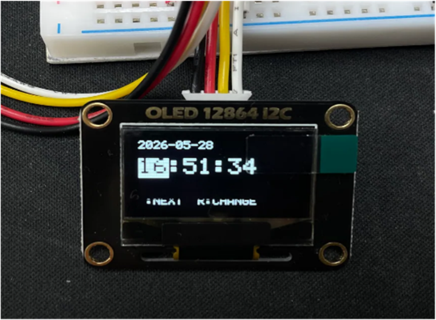
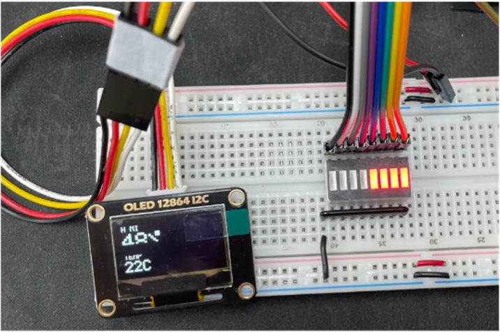
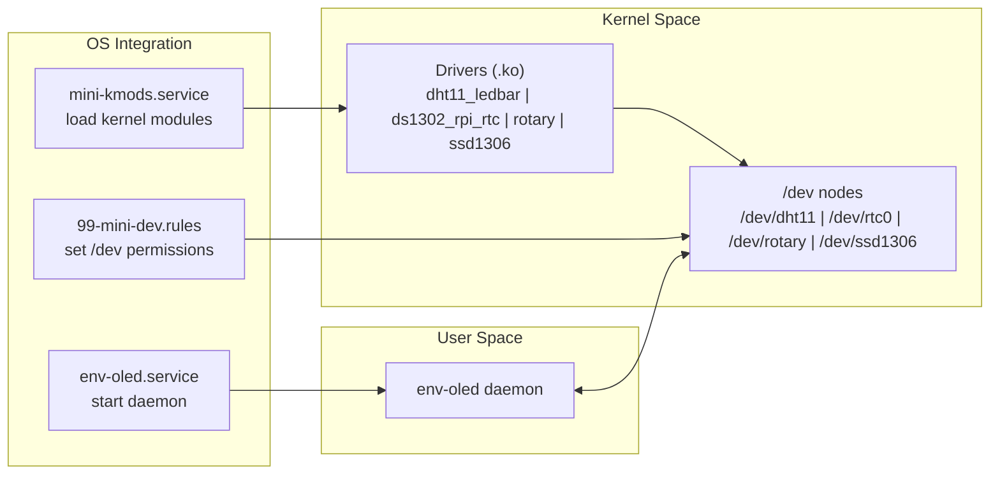
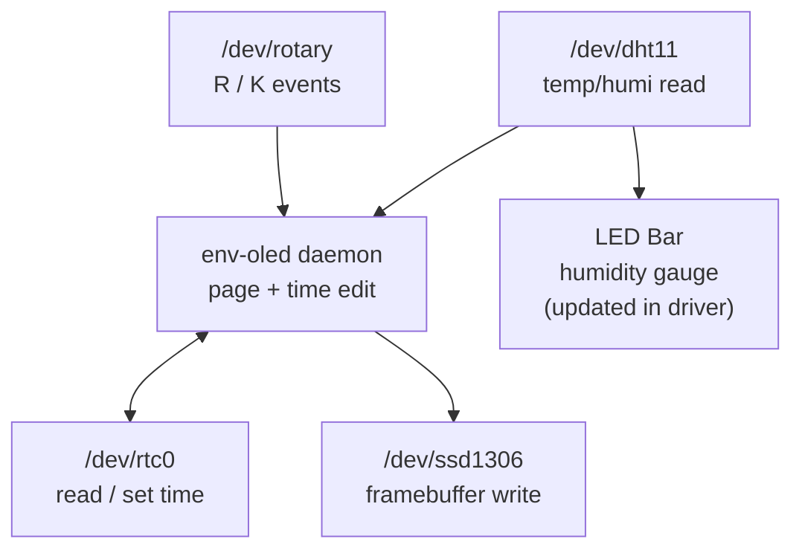
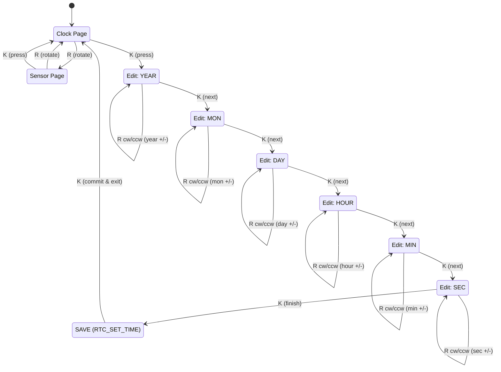

# Device Driver Mini Project (Raspberry Pi 4B)
라즈베리파이 4B에서 **커널 디바이스 드라이버 4개 + 유저스페이스 데몬 1개 + systemd/udev 자동화**까지 묶어서,
부팅하면 바로 동작하는 형태로 만든 미니 프로젝트입니다.

- OLED(SSD1306): **시간/날짜** 화면 + **온/습도** 화면 표시
- Rotary + Key: **페이지 전환**, **RTC 시간 편집/저장**
- DHT11 + LED Bar: **습도(0~8단계) 레벨 게이지** 자동 표시

---

## 🎬 Demo

<p align="center">
  
</p>

<details>
<summary><b>More demos</b></summary>

<br/>

- Mode switching  
  

- Edit time (RTC)  
  

- Humidity level → LED bar  
  

</details>

## 🔌 Hardware

- Setup photo  
  

- Schematic  
  

<details>
<summary><b>UI screenshots</b></summary>

<br/>

- Time edit UI  
  

- Sensor UI  
  

</details>

## ✨ Features (코드 기준)
OLED UI (env-oled 데몬)

/dev/ssd1306에 **128x64 프레임버퍼(1024B)**를 주기적으로 write

화면 2페이지

Clock Page: YYYY-MM-DD + HH:MM:SS

Sensor Page: HUMI xx%(큰 글씨) + TEMP xxC

Rotary/Key 동작 (env-oled.c + rotary_device_driver.c)

기본(Clock Page, edit 아님)

Rotary 회전: Clock ↔ Sensor 페이지 전환

Key(K): Clock에서 시간 편집 진입 / Sensor에서 Clock으로 복귀

편집(edit 모드)

Key(K): 필드 이동 (YEAR → MON → DAY → HOUR → MIN → SEC → EXIT)

Rotary 회전: 현재 선택 필드 값 변경

EXIT에서 Key(K): RTC에 저장(RTC_SET_TIME) → 화면에 SAVED 토스트

DHT11 + LED Bar (dht11_ledbar.c)

DHT11을 **주기적으로 샘플링(기본 2초)**해서 캐시에 저장

습도 값을 0~8단계로 변환하여 LED bar를 자동 갱신
(예: 습도 0~100% → 점등 0~8개)

RTC (ds1302_rpi_rtc.c)

DS1302 기반 RTC 드라이버가 /dev/rtc0 제공

env-oled 데몬이 RTC_RD_TIME / RTC_SET_TIME로 읽기/설정

## 🔌 Wiring (Fixed Pinout)

BCM 기준 / 괄호는 Physical Pin

OLED (I2C)

SDA: GPIO2 (Pin 3)

SCL: GPIO3 (Pin 5)

VCC: 3.3V (Pin 1/17)

GND: GND

DHT11

DATA: GPIO4 (Pin 7)

VCC: 3.3V

GND: GND

DS1302 (3-wire)

CLK: GPIO5 (Pin 29)

DAT: GPIO6 (Pin 31)

RST/CE: GPIO13 (Pin 33)

VCC: 3.3V

GND: GND

Rotary Encoder

S1: GPIO17 (Pin 11)

S2: GPIO27 (Pin 13)

KEY: GPIO22 (Pin 15)

GND: GND

LED Bar (8ch)
Channel	BCM(GPIO)	Physical Pin
1	GPIO23	Pin 16
2	GPIO24	Pin 18
3	GPIO25	Pin 22
4	GPIO12	Pin 32
5	GPIO16	Pin 36
6	GPIO20	Pin 38
7	GPIO21	Pin 40
8	GPIO26	Pin 37
## 🧩 Device Nodes & Permissions

udev 룰(99-mini-dev.rules)로 아래 노드 권한을 0666으로 설정:

/dev/ssd1306

/dev/dht11

/dev/rotary

/dev/rtc0

## 🏗️ Architecture


<details>
<summary><b>Runtime Flow (click to expand)</b></summary>


</details>

## ⚙️ Build & Install
1) Build kernel modules

현재 Makefile은 KDIR=/home/ubuntu/linux를 사용합니다. (환경에 맞게 수정)
```text
make
```
2) Build user daemon (env-oled)
```text
gcc -O2 -Wall -o env-oled env-oled.c
sudo install -m 0755 env-oled /usr/local/bin/env-oled
```
4) Install udev + systemd
```text
sudo cp 99-mini-dev.rules /etc/udev/rules.d/
sudo udevadm control --reload-rules
sudo udevadm trigger

sudo cp mini-kmods.service /etc/systemd/system/
sudo cp env-oled.service /etc/systemd/system/
sudo systemctl daemon-reload

sudo systemctl enable --now mini-kmods.service
sudo systemctl enable --now env-oled.service
```

mini-kmods.service의 .ko 경로는 현재 /home/pi07/*.ko로 되어 있으니,
실제 .ko 위치에 맞게 수정해야 합니다.

4) Verify
```text
ls -l /dev/ssd1306 /dev/dht11 /dev/rotary /dev/rtc0 2>/dev/null || true
systemctl status env-oled.service --no-pager
journalctl -u env-oled.service -f
```
## 📁 Files

ssd1306_i2c.c : SSD1306 I2C char device (/dev/ssd1306)

dht11_ledbar.c : DHT11 char device (/dev/dht11) + LED bar 습도 게이지 자동 갱신

rotary_device_driver.c : Rotary + Key char device (/dev/rotary, poll/read 지원)

ds1302_rpi_rtc.c : DS1302 RTC (/dev/rtc0)

env-oled.c : OLED UI 데몬(Clock/Sensor 페이지 + RTC 편집/저장)

mini-kmods.service : 부팅 시 커널 모듈 insmod

env-oled.service : 부팅 시 env-oled 자동 실행

99-mini-dev.rules : /dev 권한 설정

## 🧯 Troubleshooting

- **DHT11이 `DHT ERR`로 계속 실패**  
  → 소프트웨어 문제가 아니라 **배선/접촉 불량 가능성**을 먼저 의심  
  → **오실로스코프로 DHT DATA 라인 파형을 측정**해 펄스(응답 신호) 유무를 확인했고, 신호가 불안정/미도달인 것을 근거로 배선 문제로 판정  
  → 점퍼/브레드보드 연결 재정리(필요 시 풀업 적용) 후 정상 수신으로 해결  
  <p align="center">
    
  </p>

- **로터리/키 입력 디버깅**  
  → `/dev/rotary`에 대해 `cat /dev/rotary`로 **R(회전) / K(버튼) 이벤트가 정상 출력되는지** 확인하여  
     핀맵/IRQ/디바운스 문제를 빠르게 분리(입력 이벤트가 나오면 커널 드라이버/배선은 정상, 이후는 데몬 로직 점검)  
  <p align="center">
    
  </p>
  
.ko 로드 실패: mini-kmods.service의 .ko 경로 수정 + dmesg 확인

